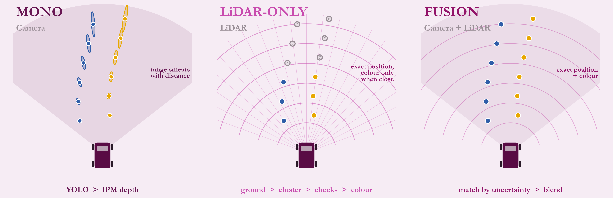
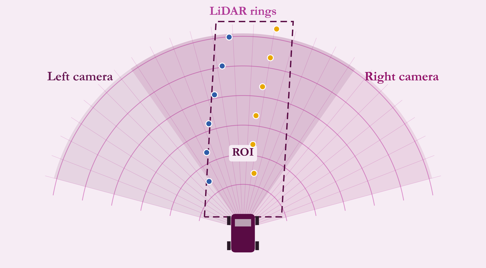

# Driverless Perception Stack

*Camera and LiDAR cone perception for a Formula Student driverless car, in C++.*

A write-up of the C++ perception stack of **IIT Bombay Racing's** Formula Student driverless car. Perception turns raw **camera and LiDAR** data into a list of cones (**distance, direction, colour**) that SLAM and the planner consume.

> **Note:** this repository contains documentation and diagrams only. The code lives in the team's private repository and is not reproduced here. The figures are schematic illustrations I drew to explain the ideas. They are not logged data, and this repo contains no measured benchmarks.



## What this is

The stack began as a Python package. Over 2026 it was rebuilt as a C++20 / CUDA / TensorRT ROS 2 node that keeps the **same output message**, so SLAM and planning needed no changes. I did most of the C++ rewrite and its tuning. I authored about 35 commits in the package between January and June 2026.

One node runs one of **five modes**, chosen by two parameters (platform and pipeline):

| Mode | Camera L | Camera R | LiDAR | Fusion |
|---|:-:|:-:|:-:|:-:|
| LiDAR only | | | yes | |
| Mono | yes | | | |
| Dual mono | yes | yes | | |
| Fusion | yes | | yes | yes |
| Dual fusion | yes | yes | yes | yes |



## Where it sits in the stack

```
 cameras ─┐                                   ┌─> SLAM (map + pose)
          ├─> PERCEPTION ─> cone list ───────┤
 LiDAR  ──┘     ^                             └─> planner
                └──── pose from SLAM (motion compensation)
```

## Contents

| Doc | Topic |
|---|---|
| [Architecture](docs/00-architecture.md) | Node design, data flow, threading, synchronisation, interfaces |
| [Python to C++](docs/01-python-to-cpp.md) | What the old pipeline did and why it was rebuilt |
| [Camera branch](docs/02-camera-branch.md) | Detection, box validation, IPM depth, pitch correction, camera-to-car frame |
| [LiDAR branch](docs/03-lidar-branch.md) | ROI, ground removal, clustering, cone checks, colour classification |
| [Fusion](docs/04-fusion.md) | Uncertainty-aware matching, blending, status of each cone |
| [Tooling and what's next](docs/05-tooling-and-next.md) | Tuning and debug tools, the PointPillars prototype |
| [Configuration and platforms](docs/06-configuration-and-platforms.md) | One config per vehicle or simulator, what is tunable |
| [Glossary](docs/07-glossary.md) | Terms used across the docs |

## Stack

C++20, CUDA, TensorRT, ROS 2, PCL, Open3D, OpenCV, Eigen, ONNX Runtime, YAML configuration, Python tooling for tuning.

## Contact

Ishaan Mondal, IIT Bombay (Mechanical Engineering, class of 2028). GitHub: [@IshaanM05](https://github.com/IshaanM05).
