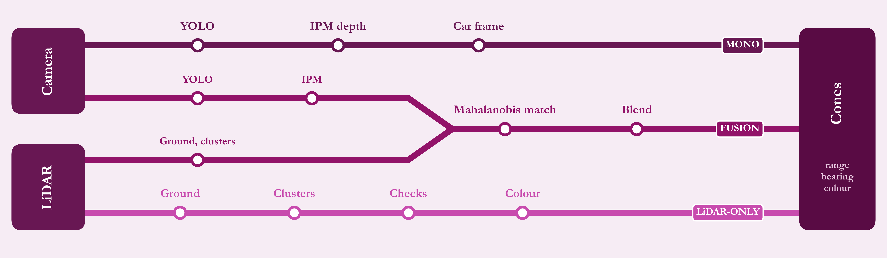

# Architecture

## One node, several pipelines

Perception runs as a single ROS 2 node written in C++20. Two parameters choose what it does:

- **platform**: which vehicle or simulator it is running on (sets topics, camera calibration, sensor mounting and tuning).
- **pipeline**: which sensors and stages to use (the five modes below).



| Mode | What runs |
|---|---|
| LiDAR only | LiDAR branch alone; no cameras needed |
| Mono | One camera: detect, estimate distance |
| Dual mono | Both cameras, results merged |
| Fusion | One camera plus LiDAR, fused |
| Dual fusion | Both cameras plus LiDAR, fused |

All modes publish the **same output**: a cone list with distance, direction and colour for each cone.

## Data flow

```
LiDAR points ──> ROI ─> ground removal ─> clustering ─> checks ─> colour ──┐
                                                                            ├─> fusion ─┐
cameras ─> resize ─> YOLO (TensorRT) ─> box validation ─> IPM depth ───────┘           │
                                                                                         v
                                                          pose compensation ─> cone list ─> SLAM, planner
```

In fusion modes the LiDAR side only has to hand over cluster centres. The camera supplies the cone hypothesis and colour, so some of the LiDAR checks are not needed. In LiDAR-only mode the LiDAR branch does everything, including colour.

## Threading and timing


- Image callbacks only **store the latest frame** and wake a worker. They never run detection themselves.
- The worker batches **both cameras through the GPU together**.
- LiDAR processing runs on its **own thread** and drops a frame if the previous one is still being processed, so work never builds up behind a slow stage.
- The timeline above is conceptual, not measured.

## Synchronising the two cameras

In dual modes the two image streams are paired by timestamp (approximate-time synchronisation). If pairing is unavailable the node falls back to using each camera's most recent frame, so one slow camera does not stall the other.

## Pose compensation

A cone is seen at image time but published a moment later, when the car has moved. Using the pose from SLAM, each cone's distance and direction are re-expressed for the car's current position before publishing. Until SLAM is publishing, a fallback pose source is used.

## Output stability

A single empty frame (a detector flicker) does not clear the cone list. An empty result is only published after several consecutive empty frames, so downstream consumers do not see cones disappear and reappear.

## Interfaces

| Direction | What |
|---|---|
| In | Camera images, LiDAR point cloud, pose from SLAM |
| Out | Cone list (distance, direction, colour per cone), annotated debug image, debug markers |

The output message is unchanged from the original Python package, which is why SLAM and the planner did not need to change.

## Debug outputs

Annotated camera frames with distance labels, 3D markers showing camera estimates, LiDAR points and match lines, and optional intermediate point clouds. See [Tooling](05-tooling-and-next.md).
