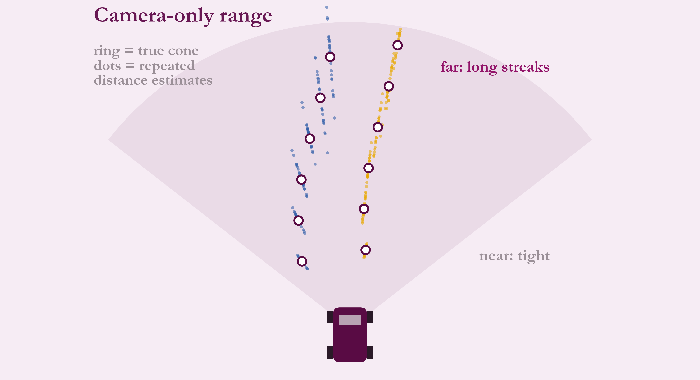
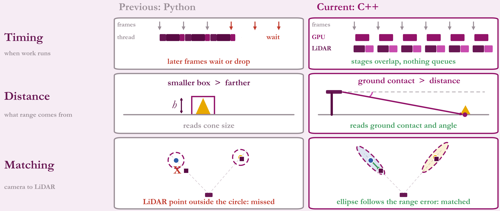

# From Python to C++

## The previous pipeline

Two modes, **mono** (camera only) and **fusion** (camera plus LiDAR), run one stage at a time inside the camera callback. There was no working LiDAR-only pipeline and no parallelism.

- The camera detects and colours cones.
- Distance was inferred from **how big the cone's box looks**. That needs the cone's real size to be right and gets worse with distance, because the same pixel error means a bigger range error far away.
- LiDAR clusters were matched to each camera cone with a **fixed-size circle**. The circle ignores which direction the camera is uncertain in.

*Schematic: rings are true cones, dots are repeated distance estimates along the camera's view ray.*

## What changed

| Aspect | Python | C++ |
|---|---|---|
| Timing | One thread, later frames wait or drop | Both cameras batched on the GPU, LiDAR on its own thread |
| Distance | From apparent box size | From geometry of the ground-contact point, with pitch correction |
| Matching | Fixed circle | Gate shaped by each sensor's uncertainty |
| Modes | Mono, Fusion | Mono, Dual mono, LiDAR only, Fusion, Dual fusion |

*Conceptual timeline, not measured.*

## Interface stayed the same

Both versions publish the same cone list message, so SLAM, the planner and the visualiser were untouched.

The reasons above come from comparing the two designs. I have no before/after latency numbers to quote.
