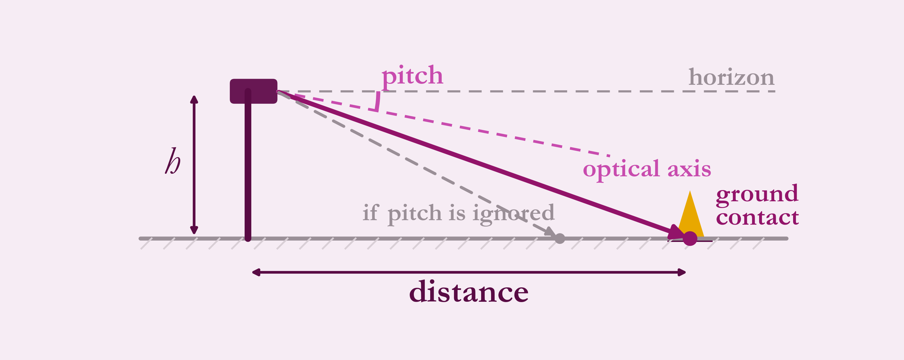
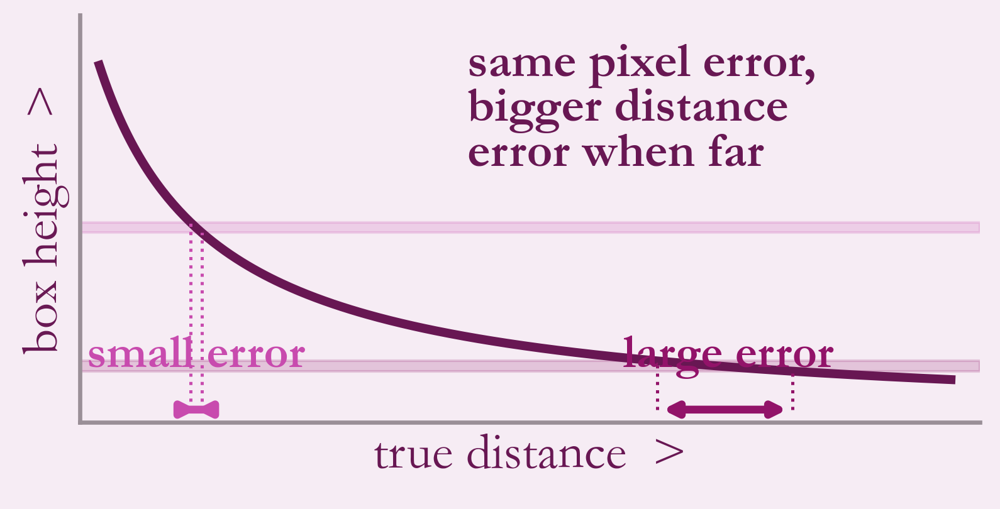

# Camera branch

```
Image -> resize (keep shape) -> YOLO on TensorRT (both cameras together)
      -> discard implausible boxes -> IPM distance -> car frame -> merge left + right
```

## Detection

A YOLO model runs through TensorRT. Left and right frames are processed as one batch. Boxes with implausible shapes or sizes are dropped before depth is estimated.

## IPM: inverse perspective mapping

Treat the road as a flat plane. The camera ray through the **bottom of the cone's box** (where it touches the ground) meets that plane at the cone's position.



Distance is camera height divided by the tangent of the total angle below the horizon (camera pitch plus the ray's angle from the optical axis). It does not depend on how big the cone looks. If the car's pitch is ignored, the same pixel lands on a different ground point (grey dashed ray in the figure).

Assumptions to be honest about: flat ground and a known camera height.

## Pitch correction

The car pitches under braking and acceleration. For each frame, the expected size of a cone (from geometry and the current pitch) is compared with its measured box. The median disagreement over visible cones is limited and smoothed, and the updated pitch feeds the next IPM computation.



*Why size-based depth was weak: the same pixel error costs far more distance at range.*

## Output

Each cone leaves this branch as distance, direction and colour in the car's frame.
