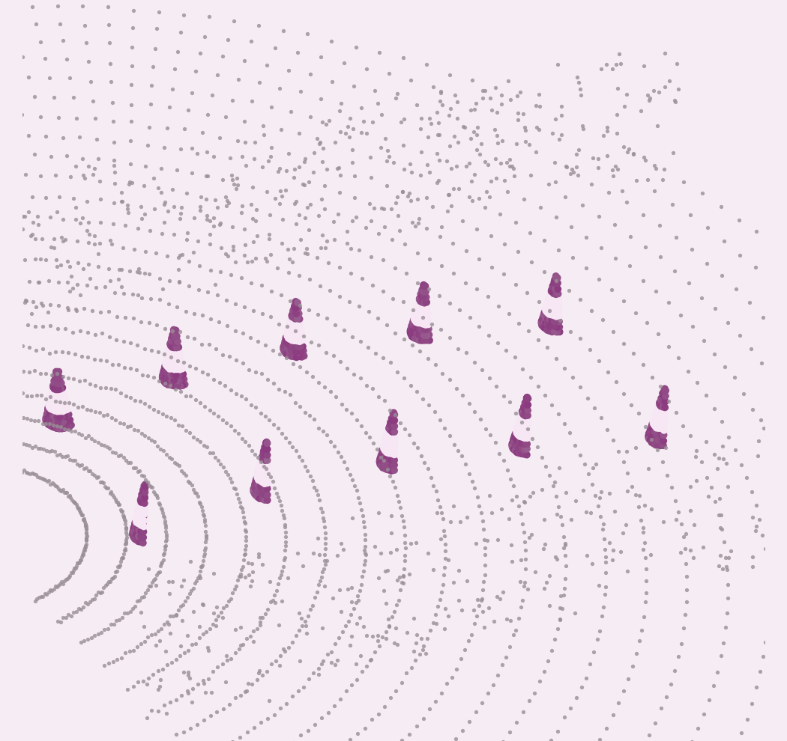
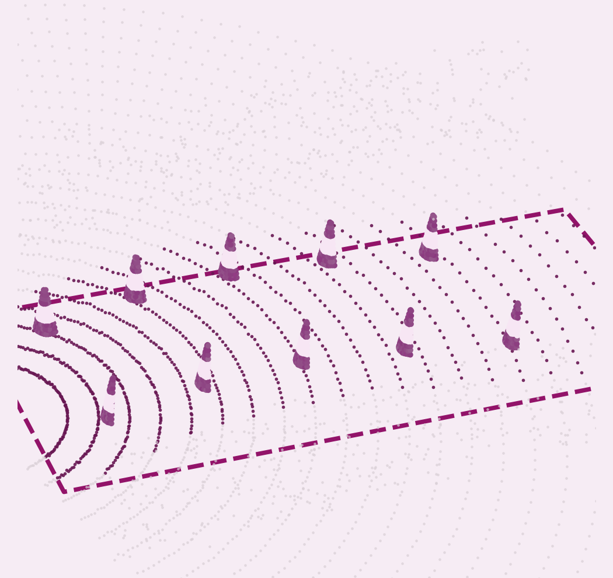
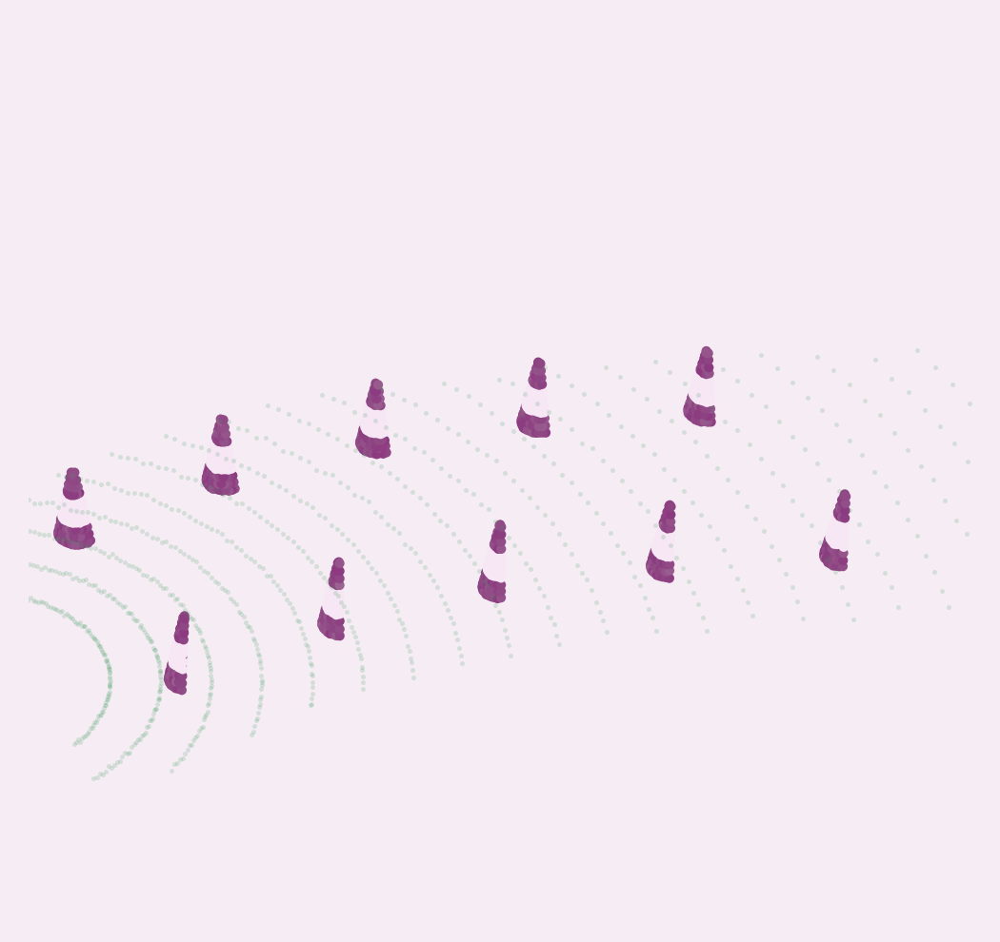
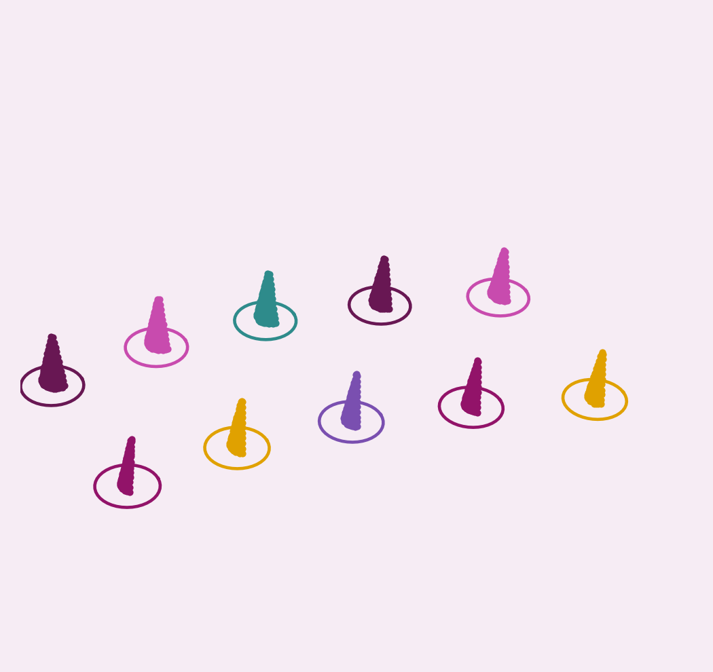
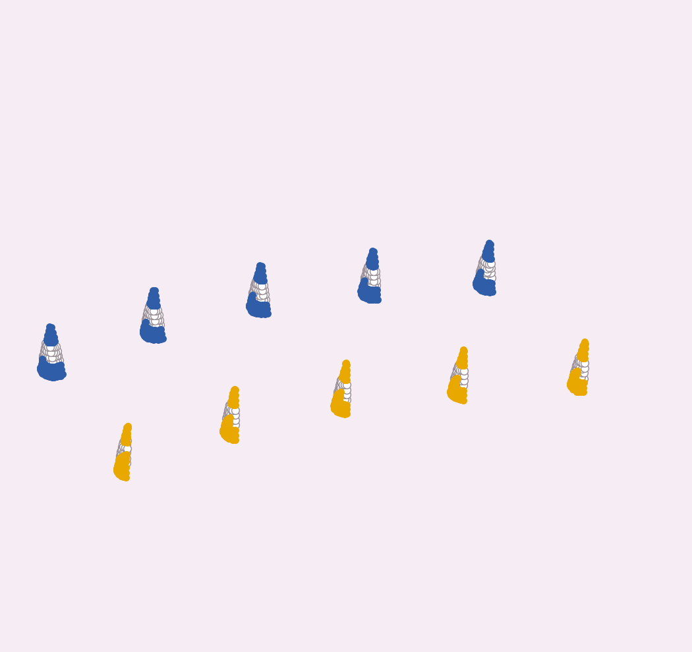

# LiDAR branch

The five stages below are shown on a synthetic scene I generated to illustrate each step. It is not logged data. Rings are scan lines on the road, and cones rise above them.

| # | Stage | What it does |
|---|---|---|
| 1 | Region of interest | Keep the corridor in front of the car |
| 2 | Ground removal | Fit the road surface and remove it |
| 3 | Clustering | Nearby points become one cone candidate |
| 4 | Cone checks | Is it really a cone? |
| 5 | Colour | Blue or yellow from reflectivity |

   

*Panels 2 to 5: ground removed, clustered, checked, coloured.*

## Cone checks

- **Base restoration:** ground removal can eat the cone's foot, so those points are given back.
- **Shape (PCA):** the cluster's principal axes should say tall and thin.
- **Point count:** a cone at that range should have a sensible number of points.

These run in LiDAR-only mode. In fusion mode the camera supplies the cone hypothesis.

## Colour from reflectivity

Cones have a reflective band, so reflectivity against height differs by colour. Two independent opinions are combined: a small learned classifier and a hand-built curve rule. **Both must agree**, otherwise the colour stays unknown rather than guessed.

## LiDAR-only fallback

I also added a LiDAR-only pipeline that runs without the cameras, so the car can keep producing cones if the cameras are unavailable.
