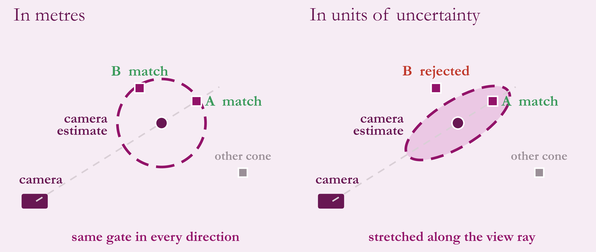
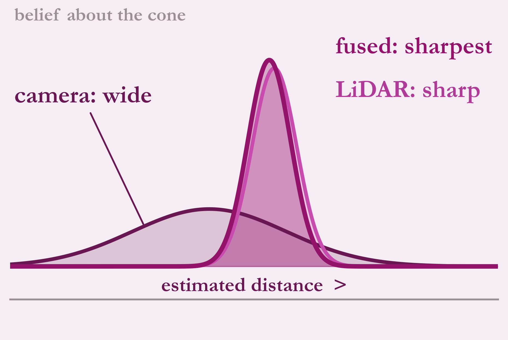

# Camera-LiDAR fusion

The camera knows **colour** and direction well but is unsure of distance. The LiDAR knows **position** precisely but has no reliable colour. Fusion keeps the best of each.

## Matching: why uncertainty, not metres

A fixed circle treats every direction the same, so it can accept a wrong candidate that is merely close. The camera's error is stretched along its viewing ray, so its gate should be too. Closeness is measured as a **Mahalanobis distance**: in units of uncertainty, not metres. A chi-square test on that distance decides whether a LiDAR cluster belongs to a camera cone.

## Blending

Two uncertain estimates of the same quantity combine into one that is more certain than either, and it sits closer to the sharper sensor. This is the weighted, Kalman-style blend. The fused cone takes **colour from the camera and position mostly from the LiDAR**.

## Tuning

The sensor uncertainty model and gate parameters were tuned offline:

1. Record LiDAR-derived ground truth.
2. Record camera detections of the same scene.
3. Sweep settings with cross-validation and keep the best.

The tuning tool also has a live dashboard.
