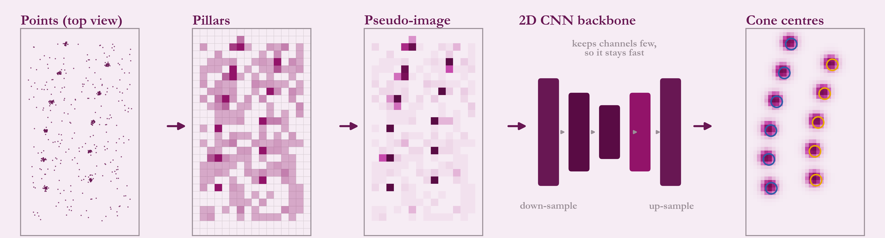

# Tooling and what's next

## Tooling

- **Live status view:** what each stage is doing, in the terminal.
- **3D debug view:** camera estimates, LiDAR points, match lines and gates.
- **Annotated camera output:** boxes with distance labels.
- **Tuning dashboard:** parameter sweeps and error plots in a browser.
- **Pitch tool:** estimates camera pitch from a gyroscope.

## Next: a learned LiDAR-only detector (PointPillars)

PointPillars chops the point cloud into small vertical columns (pillars), summarises each column, scatters the summaries into a 2D pseudo-image, runs a small 2D CNN and reads cone centres from a heat map. For cones I use a **single-class, anchor-free head** because cones are radially symmetric. Colour stays a separate downstream step.

**Prototype status** (from the team's work log):

- A dataset tool extracts cone candidates from rosbags using the existing classical LiDAR pipeline.
- A baseline network was trained, exported to TensorRT, and runs in a C++ node on a recorded bag.

**Known limits:**

- Training labels came from the classical pipeline's own decisions, not hand annotation, so the model cannot beat its teacher on that data.
- One bag, no augmentation.
- Generalisation to a different LiDAR mounting is untested.

## Also planned

- **Learned metric depth for monocular**, to complement IPM when the ground is not flat or pitch is poorly known. LiDAR can supply the ground truth.
- **Validation** across more tracks, speeds and sensors, with latency and accuracy measured against ground truth.
- Automated tests and a one-command launch.
